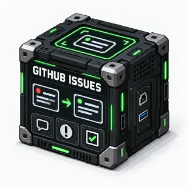

# GitHub Issues Block

<!-- block-metadata:start -->
[](model.json)
[](compatibility.json)
[](LICENSE)

Verified BloxSmith versions: **1.0.9** (bundled-block tests; see [test evidence](compatibility.json)).
<!-- block-metadata:end -->

[](media/cover.png)

## Role

`github_issues` calls the GitHub Issues REST API to support maintainer actions from a workflow.

## Files

- `block.py`: GitHub REST request construction, action dispatch, token masking, runtime outputs, and UI rendering.
- `model.json`: input/output ports, default GitHub settings, and runtime capabilities.
- `inspector_panel.html`: block-owned inspector UI for repository, token, action, issue, labels, assignees, and dry-run settings.
- `block_modal.html`: wide tabbed modal layout for full block editing.
- `node_card.html`: compact canvas card content.
- `assets/css/block_modal.css`: block-owned modal layout and responsive rules.
- `assets/js/block_modal.js`: block-owned modal tab switching.
- `tests/F5.24_github_issues_block.py`: block-local functional, UI, centralized, and zeromq_active tests.

## Ports

- Inputs:
  - `actions` (`id: 1`): optional JSON object or plain text. It can contain either a single-action payload or the standard multi-actions payload described below. Plain text can be used as `body` when the selected single action needs a body. The input port must be named `actions`; `payload` is not a supported input name.
- Outputs:
  - `result` (`id: 1`): normalized JSON result containing `ok`, `action`, `repo`, `data`, and safe diagnostics.
  - `summary` (`id: 2`): short text summary for displays or logs.

## Configuration

- `api_base_url`: GitHub-compatible API root. Default: `https://api.github.com`.
- `token_ref`: preferred credential, e.g. `secret://workspace/github_token`. Resolved only at execution through the public wallet service. When configured, a missing/locked/invalid wallet fails without falling back to another credential.
- `token`: legacy GitHub token. Without `token_ref`, an empty token uses `GITHUB_TOKEN`. Existing blueprints keep this behavior; prefer the wallet for new ones.
- `allowed_actions`: optional comma-separated action allowlist. Empty retains the existing full action set. Inputs cannot override it.
- `error_mode`: `fail` (existing behavior) or `result` (emit a recoverable `ok:false` JSON outcome).
- `require_revision`: require an existing issue's reviewed `expected_revision` for live writes. Multi-actions are refused in this mode.
- `repo`: repository in `owner/repo` format.
- `action`: one of `list_issues`, `view_issue`, `create_issue`, `comment_issue`, `add_labels`, `remove_label`, `assign_issue`, `close_issue`, `reopen_issue`.
- `issue_number`: issue number required by issue-scoped actions.
- `state`: `open`, `closed`, or `all` for `list_issues`.
- `title`: issue title for `create_issue`.
- `body`: issue body or comment body.
- `labels`: comma-separated labels, also used as a list filter.
- `assignees`: comma-separated GitHub logins.
- `state_reason`: close reason for `close_issue`.
- `include_pull_requests`: when false, `list_issues` removes GitHub PR objects returned by the Issues endpoint.
- `include_comments`: when true, read actions enrich each issue JSON with `comments_data`, using `GET /issues/{issue_number}/comments`. It is disabled by default to avoid extra API calls.
- `dry_run`: when true, write actions emit the planned request without calling GitHub.
- `per_page`: result page size for `list_issues`, capped at 100.
- `page`: issue list page, from 1 to 10000. Exactly one page is requested; `has_next_page` indicates more results without following a remote URL.
- `assignee`, `since`: optional list filters (GitHub login / `*` / `none`, and UTC ISO timestamp).
- `timeout_sec`: socket timeout per HTTP request, not a total workflow deadline. Responses are limited to 2 MiB and input/request payloads to 256 KiB.

## Controlled support workflows

An input `request_id` (ASCII letters/digits plus `._:-`, at most 128 characters) is copied to success and recoverable failure results. It is correlation, **not connector-level deduplication**. Re-executing a successful write can perform it again: an approval coordinator must own a durable journal and decide whether it may dispatch.

An optional `expected_target` object must exactly match the configured `repo` and `api_base_url`; otherwise no request or credential resolution occurs. An approval workflow should bind these values as well as the action payload and issue revision into its reviewed draft. This assertion cannot change the connection.

`view_issue` adds `revision`, a SHA-256 of the complete issue snapshot before optional comment enrichment. A single write can include `expected_revision`. Immediately before writing, the connector rereads the issue; a mismatch emits a `conflict` with the current snapshot in `result` mode and sends no mutation. This is a preflight check, **not an atomic compare-and-set or server-side lock**: another actor can change the issue between the read and write. Do not use it as an exactly-once guarantee. With `require_revision`, issue creation cannot execute because it has no existing snapshot; prepare and approve individual actions instead of a multi-action batch.

In `error_mode: result`, failures include `code`, `error`, `http.status`, and `uncertain`. A write followed by a network failure, invalid/oversized response, HTTP 408 or HTTP 5xx is conservatively uncertain; it may have been applied. The block never automatically retries. Verify remote state before deciding what to do next. Locked wallets, scope refusal and revision conflicts are not uncertain. Multi-actions still report partial success, failed and skipped entries, including uncertainty on a failed entry.

The connector does not authenticate an approver or persist draft decisions. Connect its read and write operations to an explicit approval/journal workflow; dry-run and action scoping alone are not approval. Restrict the wallet token to the permitted repository and GitHub Issues permissions as well as configuring the block scope.

API roots must use HTTPS, except HTTP loopback endpoints for local integration tests. Redirects are refused to avoid forwarding credentials or replaying mutations; update a moved repository/API root explicitly. Environment proxies are not inherited. Existing API version `2022-11-28` is retained. Comment enrichment reads only its first page, even when the issue list uses a later page. References: [GitHub Issues API](https://docs.github.com/en/rest/issues/issues), [pagination](https://docs.github.com/en/rest/using-the-rest-api/using-pagination-in-the-rest-api), [API best practices](https://docs.github.com/en/rest/using-the-rest-api/best-practices-for-using-the-rest-api).

## Runtime Behavior

`execute_runtime()` reads repository, token, dry-run, API base URL, timeout, and related connection settings from the block configuration. The optional `actions` input provides only action-level data. The block validates the selected action or multi-action sequence, calls GitHub REST endpoints with `urllib`, then emits:

- JSON result on `result`;
- readable summary on `summary`.

Read actions can be attempted without a token for public repositories. When `include_comments` is enabled, `list_issues` and `view_issue` add a `comments_data` array to each returned issue object. This performs one extra comments request per issue, so it should stay disabled unless comment content is required. Write actions require a token unless `dry_run` is true. The token is never included in logs, metadata, or outputs.

For a standard multi-actions payload, `issue_number` is read once at the root and actions are executed in order. Supported entries are `add_labels`, `remove_labels`, `add_comment`, and `close_issue`. `remove_labels` reuses the existing `remove_label` implementation, and `add_comment` reuses `comment_issue`. If one action fails, the block returns a structured result containing successful actions, the failed action with its error, and remaining actions marked `skipped`.

The same implementation runs in One Shot Simulation (`centralized`) and Active Runtime (`zeromq_active`) through the generic block executor.

## UI Behavior

The inspector and wide modal expose repository, token, action, issue fields, labels, assignees, dry-run, paging, and comment options. Sensitive token values are not echoed back in HTML. Editable fields stay local until the user clicks **Apply**; empty sensitive fields keep the existing token. The modal declares `data-block-runtime-refresh="autonomous"`, so block-owned tabs and draft settings stay stable while runtime polling is active.

## Examples

Single-action input on `actions` to list open issues while `repo` stays in config:

```json
{
  "action": "list_issues",
  "state": "open"
}
```

List issues with comment contents by enabling `include_comments` in the block configuration. Each issue in `data` then contains `comments_data`:

```json
{
  "data": [
    {
      "number": 42,
      "title": "Example",
      "comments": 2,
      "comments_data": [
        { "id": 101, "body": "First comment" }
      ]
    }
  ]
}
```

Comment on issue `42` with a text input:

```json
{
  "action": "comment_issue",
  "issue_number": 42
}
```

Standard multi-actions input on `actions`:

```json
{
  "issue_number": 123,
  "actions": [
    { "action": "add_labels", "labels": ["status:ready-for-dev", "priority:p2"] },
    { "action": "remove_labels", "labels": ["todo"] },
    { "action": "add_comment", "body": "Triage comment." },
    { "action": "close_issue", "state_reason": "not_planned" }
  ]
}
```

`repo`, `token`, `dry_run`, `api_base_url`, `timeout_sec`, and other connection/runtime settings stay in the block configuration and must not be supplied by this input payload.

## Maintenance Notes

GitHub Issues behavior belongs in this block. Do not add GitHub Issues-specific branches to the orchestrator or active runtime worker; use the generic block executor contract instead.


## Compatibility policy

[compatibility.json](compatibility.json) records HackInvent's verified BloxSmith versions and test evidence. Only the versions listed above have been verified, using the block-owned suites in a **bundled-block test installation**. This is not a certification of managed-package installation, every browser/OS, or live provider availability. Other framework versions are unverified, not necessarily incompatible.

The block-version badge follows `model.json`, not a published Git tag. `unversioned` means that no block release version is declared; no number is inferred from the framework version. The framework still uses `model.json` for its runtime/install contract; the tester-owned JSON does not replace it. Official integration tests run in the private `bloxmith-blocs` workspace. Test helpers and the proprietary framework are not bundled in this public block repository.

## Properties ergonomics

Modal and inspector styles are owned by this package and scoped to its exact
release. Forms adapt to narrow panels, checkboxes stay beside their labels, and
long values do not widen the inspector. Existing labels are associated with
controls; keyboard navigation complements the block’s own tab handlers.
These presentation helpers do not change port bindings, authored settings,
runtime behavior or the block’s original surface cleanup.
